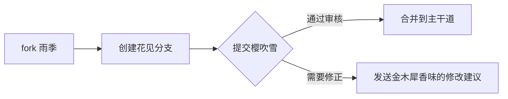

```markdown
## 🌧️⃟ TokyoRain - 在代码世界降下东京式隐秘细雨 

<p align="center">
  
</p>

## 🎴 东京雨幕超能力

- 🌧️ **雨滴变形术**：每滴雨（payload）都有独特的折射率（混淆模式），让检测系统只见雨幕不见雨滴
- 🚇 **地下雨道系统**：通过Ngrok构建东京式地下排水隧道（流量伪装），让数据像山手线的列车般隐秘穿行
- 🌂 **透明雨伞会话舱**：5把雨伞同时绽放在新宿街头（多会话管理），每把伞下都是独立的数字雨季
- 🌀 **澀谷十字混淆算法**：将`Get-Process`变成霓虹灯牌般的`G''et-Pr''ocess`，如同迷离的涉谷街头广告
- 🌈 **银座霓虹终端**：用Colorama绘制六本木之丘般的夜景控制台，每个字符都闪耀东京塔的光芒

## 🌂 收集东京雨滴

```bash
# 克隆雨季到本地（需要git雨伞）
git clone https://github.com/9Insomnie/TokyoRain.git

# 进入雨幕空间
cd TokyoRain/

# 安装防雨装备（依赖库）
pip install -r requirements.txt  # 建议搭配宇治抹茶食用
```

## 🚥 启动降雨协议

### 基础天气模式
```bash
# 在秋叶原上空造雨（替换为你的IP）
python tokyo.py -l 192.168.0.107 -p 3399

# 查看原始雨滴成分（-r参数）
python tokyo.py -r raw  # 小心雨滴打湿屏幕
```

### 极端天气预警
```bash
# 启动地下铁防洪模式（Ngrok隧道）
python tokyo.py -n ngrok  # 需要准备防水密钥
```

### 实时气象图
```console
[🌧️] 代代木公园站接入雨云 192.168.1.102:54188

正在降雨 --> [雨伞编号::1, 192.168.1.102::54188 ]
[📡] CTRL+C切换观测点
[⚠️] 输入0关闭所有气象站
-------------------------------------------------
[?] 选择雨伞编号 (1-5) 或输入0停雨: 1

192.168.1.102:54188 >>> [🌂银座观测点] 1: systeminfo
雨滴指纹: Windows Server 2019 🌐
```

## 🌧️ 人工降雨原理

### 气象生成模型
1. **水汽凝结**：采集10个UUID作为原始云层
2. **雨滴塑形**：将`System32`变成`Sy??te??32`式的水雾粒子
3. **云层加密**：用`$3dbfe2ebf`这样的气象符号标记每滴雨
4. **降雨编码**：通过Base64将雨滴编译成摩斯密码般的天气信号

### 东京式降水管理
- 🌧 **雨伞编号系统**：每个会话都是表参道的一把限定款透明雨伞
- 🚦 **数字斑马线**：1-5号键对应原宿五个网红十字路口
- 🍵 **停雨仪式**：输入0时所有雨伞自动收拢，像深夜打烊的喫茶店门帘轻摆

## ⚡ 气象预警

❗ 本降雨系统仅限晴空塔授权区域使用  
❗ 禁止在东京迪士尼乐园等童话区域实施人工降雨  
❗ 建议在台场海滨公园（沙箱环境）进行降雨实验

## 🌸 樱花贡献指南

欢迎为东京雨季增添新的花色：


## 📜 晴雨表（许可证）
MIT Licensed | 让世界每个角落都能下起合规的东京雨  
开发者：[[9Insomnie]](https://github.com/9Insomnie)  
灵感源自《言叶之庭》的数字雨幕 🌂📘

---

<p align="center">
  让我们的代码像神宫外苑的银杏雨般优雅飘落<br>
  「また、あしたの雨に。」—— 东京Rain开发者手册
</p>
```
